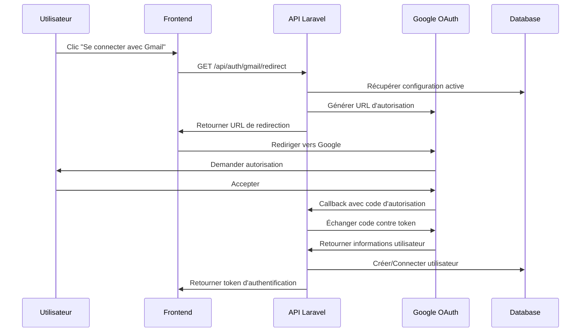

# 📧 Documentation API Authentification Gmail

## 🎯 Vue d'ensemble

Cette API permet aux utilisateurs de se connecter directement via leur compte Gmail en utilisant OAuth 2.0. L'administrateur peut configurer les paramètres Gmail OAuth via l'interface d'administration Filament.

## 🏗️ Architecture

### Composants créés

1. **Modèle**: `GmailConfiguration` - Stocke les configurations OAuth
2. **Service**: `GmailAuthService` - Logique d'authentification Gmail
3. **Contrôleur**: `GmailAuthController` - Endpoints API
4. **Ressource Filament**: Interface admin pour la configuration
5. **Migration**: Table `gmail_configurations`

### Flux d'authentification



## 🔧 Configuration

### 1. Configuration Google Cloud Console

1. **Créer un projet** sur [Google Cloud Console](https://console.cloud.google.com/)
2. **Activer l'API Google Identity**:
   - APIs & Services > Library
   - Rechercher "Google Identity" ou "Google+ API"
   - Cliquer "Enable"
3. **Créer des identifiants OAuth 2.0**:
   - APIs & Services > Credentials
   - Create Credentials > OAuth 2.0 Client IDs
   - Application type: Web application
   - Authorized redirect URIs: `https://votre-domaine.com/api/auth/gmail/callback`

### 2. Configuration dans l'administration

1. Accéder à l'admin Filament: `/admin`
2. Naviguer vers **Authentification > Configuration Gmail**
3. Créer une nouvelle configuration:
   - **Nom**: Gmail OAuth Configuration
   - **Client ID**: Votre Client ID Google
   - **Client Secret**: Votre Client Secret Google
   - **URI de redirection**: `https://votre-domaine.com/api/auth/gmail/callback`
   - **Permissions**: `openid`, `profile`, `email`
   - **Active**: ✅ Oui

## 📡 Endpoints API

### GET `/api/auth/gmail/status`

Vérifier le statut de la configuration Gmail.

**Réponse:**
```json
{
  "configured": true,
  "configuration": {
    "name": "Gmail OAuth Configuration",
    "is_complete": true,
    "scopes": ["openid", "profile", "email"],
    "redirect_uri": "https://example.com/api/auth/gmail/callback"
  }
}
```

### GET `/api/auth/gmail/redirect`

Obtenir l'URL de redirection vers Google OAuth.

**Réponse:**
```json
{
  "success": true,
  "redirect_url": "https://accounts.google.com/oauth/authorize?client_id=...",
  "message": "URL de redirection Gmail générée avec succès"
}
```

### GET `/api/auth/gmail/callback`

Endpoint de callback appelé par Google après l'authentification.

**Paramètres de requête:**
- `code`: Code d'autorisation de Google
- `state`: État de sécurité (optionnel)

**Réponse (utilisateur existant):**
```json
{
  "success": true,
  "message": "Connexion réussie via Gmail",
  "token": "1|abc123...",
  "user": {
    "id": 1,
    "first_name": "John",
    "last_name": "Doe",
    "email": "john@gmail.com",
    "is_professional": false,
    "email_verified_at": "2025-09-16T04:43:07.000000Z"
  },
  "is_new_user": false
}
```

**Réponse (nouvel utilisateur):**
```json
{
  "success": true,
  "message": "Compte créé et connexion réussie via Gmail",
  "token": "2|def456...",
  "user": {
    "id": 2,
    "first_name": "Jane",
    "last_name": "Smith",
    "email": "jane@gmail.com",
    "is_professional": false,
    "email_verified_at": "2025-09-16T04:43:07.000000Z"
  },
  "is_new_user": true
}
```

## 🔒 Sécurité

### Chiffrement des données sensibles

- Le `client_secret` est automatiquement chiffré en base de données
- Les tokens d'accès ne sont pas stockés côté serveur
- Utilisation de Laravel Sanctum pour les tokens d'API

### Validation des domaines

- L'URI de redirection doit être configurée dans Google Cloud Console
- Validation des paramètres OAuth côté serveur

## 🧪 Tests

### Test automatique

```bash
php test_gmail_auth.php
```

### Test manuel

1. **Vérifier la configuration:**
   ```bash
   curl http://localhost:8000/api/auth/gmail/status
   ```

2. **Obtenir l'URL de redirection:**
   ```bash
   curl http://localhost:8000/api/auth/gmail/redirect
   ```

3. **Test complet dans le navigateur:**
   - Ouvrir l'URL retournée par `/redirect`
   - Se connecter avec Google
   - Vérifier la redirection vers `/callback`

## 🚀 Intégration Frontend

### React/JavaScript

```javascript
// 1. Obtenir l'URL de redirection
const getGmailLoginUrl = async () => {
  try {
    const response = await fetch('/api/auth/gmail/redirect');
    const data = await response.json();
    
    if (data.success) {
      // Rediriger vers Google
      window.location.href = data.redirect_url;
    }
  } catch (error) {
    console.error('Erreur Gmail auth:', error);
  }
};

// 2. Bouton de connexion
<button onClick={getGmailLoginUrl}>
  Se connecter avec Gmail
</button>

// 3. Gérer le retour (dans une page de callback)
const handleGmailCallback = async () => {
  const urlParams = new URLSearchParams(window.location.search);
  const code = urlParams.get('code');
  
  if (code) {
    try {
      const response = await fetch(`/api/auth/gmail/callback${window.location.search}`);
      const data = await response.json();
      
      if (data.success) {
        // Stocker le token
        localStorage.setItem('auth_token', data.token);
        // Rediriger vers le dashboard
        window.location.href = '/dashboard';
      }
    } catch (error) {
      console.error('Erreur callback Gmail:', error);
    }
  }
};
```

## 🔧 Dépannage

### Erreurs courantes

1. **"Configuration Gmail non trouvée"**
   - Vérifier qu'une configuration est créée et active dans l'admin
   - S'assurer que tous les champs requis sont remplis

2. **"Invalid redirect_uri"**
   - Vérifier que l'URI de redirection est identique dans Google Cloud Console et dans la configuration
   - S'assurer que l'URI utilise HTTPS en production

3. **"Access denied"**
   - Vérifier les permissions demandées (scopes)
   - S'assurer que l'utilisateur a accepté les permissions

### Logs

Les logs sont disponibles dans `storage/logs/laravel.log` avec le préfixe `Gmail`.

## 📋 Checklist de déploiement

- [ ] Configuration Google Cloud Console créée
- [ ] URI de redirection configurée (HTTPS en production)
- [ ] Configuration Gmail créée dans l'admin
- [ ] Configuration testée avec `test_gmail_auth.php`
- [ ] Variables d'environnement configurées si nécessaire
- [ ] Tests d'intégration frontend effectués
